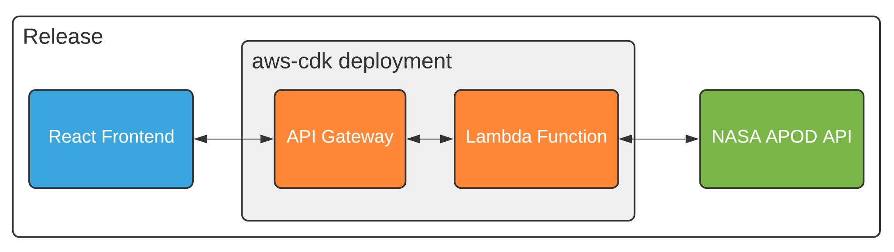

# AWS-CDK with a React frontend

This demo showcases a simple aws-cdk and react application and is intended to be used on Release as an example. In this scenario we are creating an api gateway and lambda function that pulls images from the NASA api. The api url output from the cdk deployment is sent to a shared volume at `/app/public` which is then parsed and used by the frontend.

  

# Release Setup

TBD

# Docker Setup

1. Create a `.env` file for the frontend and in `/cdk` for the cdk portion by following the `.env.example` template files in each directory.

2. Run `docker-compose up -d`

3. Visit `http://localhost:3000`

See the [cdk readme](./cdk/README.md) for additional information about the stack.

# Expected Result

  

