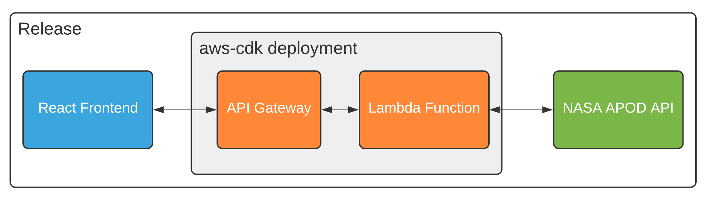

# CDK API-Gateway & Lambda Integration with JavaScript

  

## Stack Setup

(This is handled by the frontend scripts in the `package.json`)

Choose one option:

1. Install AWS CLI and configure with `aws configure`.

OR

2. export the variables `AWS_ACCESS_KEY_ID`, `AWS_SECRET_ACCESS_KEY`, and `AWS_DEFAULT_REGION`.

Then:

- Deploy stack with `yarn deploy`.
- Optionally curl the api-gateway endpoint to see the lambda response.

## Available Commands

| Command          | Description                                                  |
| ---------------- | ------------------------------------------------------------ |
| `yarn deploy`    | setup & deploy this stack to your default AWS account/region |
| `yarn destroy`   | tear down the stack                                          |
| `yarn cdk diff`  | compare deployed stack with current state                    |
| `yarn cdk synth` | emit the synthesized CloudFormation template                 |
